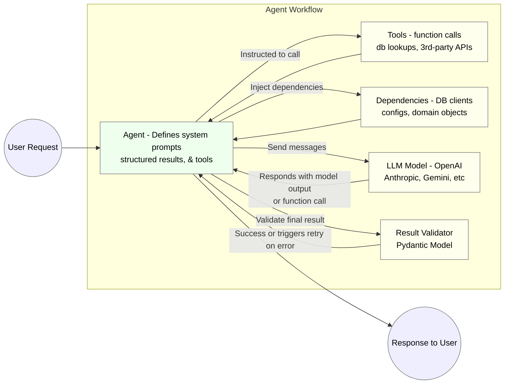

# PydanticAI Agents

The Augmented LLM using PydanticAI.

```mermaid
flowchart LR
    %% Define classes for styling (optiofnal)
    classDef agent fill:#EFE,stroke:#777,stroke-width:1px,color:#000
    classDef tool fill:#FFE,stroke:#777,stroke-width:1px,color:#000
    classDef result fill:#EEF,stroke:#777,stroke-width:1px,color:#000

    %% Nodes
    A((User Request))
    B[Agent - Defines system prompts<br/>structured results, & tools]
    C[Tools - function calls<br/>db lookups, 3rd-party APIs]
    D[Dependencies - DB clients<br/>configs, domain objects]
    E[LLM Model - OpenAI<br/>Anthropic, Gemini, etc]
    F[Result Validator<br/>Pydantic Model]
    G((Response to User))

    %% Subgraph for clarity (optional)
    subgraph "Agent Workflow"
    B -- "Instructed to call" --> C
    B -- "Inject dependencies" --> D
    B -- "Send messages" --> E
    B -- "Validate final result" --> F
    end

    %% Edges
    A --> B
    C --> B
    D --> B
    E -- "Responds with model output<br/>or function call" --> B
    F -- "Success or triggers retry on error" --> B
    B --> G

    %% Class assignments (optional)
    class B agent
    class C,D,E,F tool
    class A,G result
```